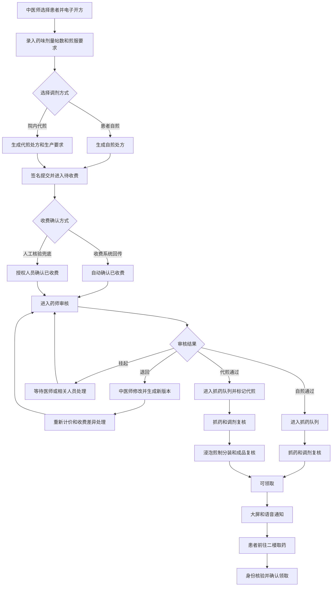

# 中医师电子开方、中药调剂代煎与排队叫号系统 PRD

## 1. 文档信息

- 产品名称：中医师电子开方、中药调剂代煎与排队叫号系统
- 所属系统：协和患者病历协同系统扩展模块
- 文档类型：产品需求文档
- 当前阶段：业务方案确认，暂不开发
- 核心模式：中医师电子开方、收费前置、药师审核、自煎与院内代煎自动分流、大屏与语音通知、患者领取闭环
- 收费集成策略：同时兼容收费系统自动回传和授权人员人工确认，现阶段以人工确认作为默认兜底
- 正常主流程：患者不负责在医师与药房之间传递处方，只需完成缴费、等待通知并领取药品

## 2. 项目背景

当前流程依赖患者持医师手写中药处方前往二楼药房交方。药房接方后根据经验口头估计取药时间，患者自行判断何时返回领取。该模式不仅存在等待时间不确定的问题，也将处方传递责任放在患者身上，医师、收费、药房和患者之间缺少统一、可追溯的业务链路。

本项目将业务起点前移至中医师端。中医师在系统内完成电子开方，录入药味、剂量、帖数、煎服要求，并选择患者自煎或院内代煎。处方提交后先进入收费环节；系统确认收费完成后，才允许药师审核；药师审核通过后，系统根据调剂方式自动分流到抓药队列或代煎生产队列。成品可领取时，再通过一楼大屏和语音通知患者。

需要解决的核心问题：

1. 消除患者携带纸质处方在医师与药房之间传递的依赖。
2. 确保未收费处方不能进入药师审核和药房生产队列。
3. 确保未经药师审核的处方不能抓药、代煎或通知领取。
4. 同时支持患者自煎和院内代煎，自动进入不同生产流程。
5. 将处方退回、修改、重新计价、补费、退款、缺药和换药纳入可追溯闭环。
6. 将不稳定的口头时间承诺改为可观察的业务状态。
7. 通过匿名大屏和语音叫号降低患者反复上楼询问的成本。

## 3. 产品目标与非目标

### 3.1 核心目标

1. 建立中医师开方、收费确认、药师审核、调剂或代煎、叫号、发药的完整闭环。
2. 让电子处方及煎药要求由系统直接传递给药房，患者不再承担交方责任。
3. 对自煎和院内代煎进行结构化分流，避免口头交接遗漏。
4. 将收费作为药师审核的前置门控，将审核作为药房生产的前置门控。
5. 在收费接口暂不确定时保证业务可运行，并为后续自动回传预留标准接口。
6. 确保只有完成对应生产和复核要求的任务才能通知患者领取。
7. 在公共区域保护患者隐私，同时保留可靠的领取身份核验。
8. 建立处方版本、收费证据、审核意见、生产节点和领取结果的审计链路。

### 3.2 非目标

当前规划不承担以下职责：

1. 不替代医院法定收费系统完成定价、结算、退费和票据管理。
2. 不在缺少合规接口和对账机制时自行认定线上支付成功。
3. 不向患者承诺精确到分钟的完成时间。
4. 不将公共大屏作为患者身份认证或发药凭证。
5. 不在公共大屏展示诊断、处方药味、剂量、帖数或煎药信息。
6. 不直接复用普通物资库存逻辑管理中药饮片；库存联动需单独满足批次、效期和追溯要求。
7. 首期不包含配送、快递和院外代煎机构协同。
8. 首期不要求患者通过移动端在线查看完整处方。

## 4. 业务范围与实施边界

### 4.1 核心业务范围

- 中医师创建、暂存、校验、提交和修改电子处方。
- 录入完整处方明细、煎服信息和调剂方式。
- 支持 `SELF_DECOCTION` 患者自煎。
- 支持 `HOSPITAL_DECOCTION` 院内代煎。
- 生成待收费记录并接收收费状态。
- 支持收费系统自动回传。
- 支持授权人员人工核验缴费凭证并确认。
- 药师在收费完成后审核处方。
- 药师可通过、退回中医师修改或挂起处方。
- 审核通过后自动创建对应药房任务。
- 自煎进入抓药、调剂复核和待领取流程。
- 院内代煎进入抓药、调剂复核、浸泡、煎制、包装、成品复核和待领取流程。
- 大屏匿名展示和语音叫号。
- 发药身份核验和领取确认。
- 全流程状态历史、审计和异常处理。

### 4.2 纸质处方定位

电子处方是系统内正常主流程的数据源。是否仍需打印或签署纸质处方，应由医院处方管理制度、药事管理要求和实际合规审查决定。

系统设计原则：

- 不再要求患者将纸方送至药房作为业务触发条件。
- 如制度要求保留纸质处方，可由中医师端打印，作为签字、归档或患者留存材料。
- 药房应以系统内已收费、已审核的有效处方版本为生产依据。
- 系统离线时允许启用受控纸质应急流程，恢复后必须补录并关联原始记录。

### 4.3 收费集成边界

收费状态支持两种来源：

1. `AUTO_CALLBACK`：HIS 或收费系统自动回传。
2. `MANUAL_CONFIRMATION`：授权人员核对收费凭证后人工确认。

现阶段默认采用人工确认兜底，但数据结构、接口和审计应从首期开始兼容自动回传，避免后续重复改造。

人工确认只表示“已核验外部收费结果”，不能替代收费系统生成账单、收费、退费或票据。

### 4.4 设备范围

一楼通知终端需要：

- 一台可运行浏览器的电脑、迷你主机或安卓播放终端。
- 一块电视或显示器。
- 音箱、功放或有源扬声器。
- 稳定的单位内网连接，有线网络优先。

叫号需要扬声器而非麦克风。麦克风仅用于声音采集，不是首期必需设备。

## 5. 用户与角色责任

### 5.1 中医师

- 选择患者和本次就诊。
- 创建并暂存电子处方。
- 录入药味、剂量、单位、炮制要求、帖数、用法和医嘱。
- 选择自煎或院内代煎。
- 选择院内代煎时补充代煎生产参数和领取要求。
- 完成处方校验、签名或确认并提交。
- 查看收费、审核和药房处理状态。
- 处理药师退回，形成新的处方版本。
- 在制度要求时打印处方、缴费引导单或取药凭条。

### 5.2 收费人员或收费确认人员

- 在外部收费系统完成实际收费，或查看自动回传结果。
- 无接口或接口异常时，核验票据号、收费流水或缴费凭证。
- 人工确认已收费、标记待核验或撤销误确认。
- 对退款、补费和收费差异进行状态同步。
- 不得修改处方临床内容。

### 5.3 审方药师

- 仅审核已确认收费且版本有效的处方。
- 核对药味、剂量、配伍禁忌、用法、帖数、特殊人群风险和煎药要求。
- 审核通过、退回中医师修改或挂起待沟通。
- 记录结构化原因和审核意见。
- 审核通过后触发系统自动分流。
- 不得直接静默修改中医师已签署处方；需要修改时应退回并生成新版本。

### 5.4 调剂人员

- 领取审核通过的待抓药任务。
- 按处方有效版本抓药。
- 记录开始、完成、缺药、批次或其他异常。
- 将配齐药品提交调剂复核。

### 5.5 调剂复核人员

- 核对处方版本、药味、剂量、帖数和已配药品。
- 通过后将自煎任务转为待领取，将代煎任务转入代煎生产。
- 退回抓药或挂起并填写原因。
- 记录复核人员与时间。

### 5.6 代煎人员

- 接收完成调剂复核的代煎任务。
- 执行浸泡、煎制、分装和包装。
- 记录批次、设备、开始结束时间、操作人员和异常。
- 完成成品复核后转为待领取。

### 5.7 发药人员

- 查看待领取任务和通知状态。
- 核验取药号、患者身份及必要辅助信息。
- 支持手动重播和暂未到场标记。
- 确认已领取并记录核验方式。

### 5.8 药房管理员

- 配置岗位权限、双人复核、优先级、状态回退和播报策略。
- 管理大屏终端和语音设备。
- 处理误确认、重大回退、跨日任务和异常交接。
- 查看统计、审计、收费对账差异和未领取清单。

### 5.9 患者

正常情况下只需要：

1. 按院内流程完成缴费。
2. 获取并记住取药号或查看中医师端打印凭条。
3. 在一楼等待大屏和语音通知。
4. 收到通知后前往二楼取药。
5. 配合完成身份核验。

患者不负责将处方从中医师端传递到药房。

### 5.10 大屏终端

大屏终端使用独立受限身份，只能：

- 获取公共队列快照。
- 接收公共叫号事件。
- 播放语音。
- 上报心跳和播放结果。

不得访问完整姓名、联系方式、诊断、病历、处方、收费明细或代煎参数。

## 6. 核心业务流程



## 7. 分层状态模型

为避免一个超大状态枚举混合处方、收费、审核、生产和领取语义，系统应采用相互关联的分层状态。

### 7.1 处方状态

| 状态 | 中文名称 | 说明 |
|---|---|---|
| `DRAFT` | 草稿 | 中医师编辑中，药房不可见 |
| `SUBMITTED` | 已提交 | 已签名或确认，等待收费 |
| `RETURNED` | 已退回 | 药师退回中医师修改 |
| `SUPERSEDED` | 已被新版本替代 | 旧版本不可继续生产 |
| `CANCELLED` | 已取消 | 经授权作废 |
| `COMPLETED` | 已完成 | 对应任务已经领取闭环 |

核心约束：提交后临床内容不可原地覆盖；任何修改都生成新版本并保留旧版本。

### 7.2 收费状态

| 状态 | 中文名称 | 说明 |
|---|---|---|
| `UNPRICED` | 待计价 | 尚未获得应收金额或收费项目 |
| `PENDING_PAYMENT` | 待缴费 | 已计价，等待患者缴费 |
| `PAYMENT_VERIFYING` | 缴费核验中 | 接口状态不明或等待人工核验 |
| `PAID` | 已收费 | 自动回传或人工核验成功 |
| `ADDITIONAL_PAYMENT_REQUIRED` | 待补费 | 处方修改后金额增加 |
| `REFUND_REQUIRED` | 待退差额 | 处方修改或取消后需退费 |
| `REFUNDED` | 已退费 | 外部收费系统确认退费完成 |
| `PAYMENT_VOIDED` | 收费作废 | 原收费关联失效 |

核心约束：只有当前有效处方版本对应的收费状态为 `PAID`，才可进入药师审核。

### 7.3 药师审核状态

| 状态 | 中文名称 | 说明 |
|---|---|---|
| `NOT_READY` | 不可审核 | 未收费或处方版本无效 |
| `PENDING_REVIEW` | 待审核 | 已收费，等待药师审核 |
| `REVIEWING` | 审核中 | 药师已领取审核任务 |
| `APPROVED` | 审核通过 | 允许创建药房生产任务 |
| `RETURNED_TO_DOCTOR` | 退回医师 | 需要修改处方 |
| `ON_HOLD` | 审核挂起 | 等待沟通、资料或其他处理 |
| `REJECTED` | 审核拒绝 | 处方不可执行，需取消或重开 |

核心约束：未经 `APPROVED`，系统不得创建抓药或代煎生产任务。

### 7.4 自煎调剂状态

| 状态 | 中文名称 | 是否公共展示 |
|---|---|---|
| `QUEUED_FOR_PREPARATION` | 等待抓药 | 是，可显示等待中 |
| `PREPARING` | 抓药中 | 是，可显示处理中 |
| `PENDING_DISPENSING_REVIEW` | 待调剂复核 | 是，可合并为处理中 |
| `READY_FOR_PICKUP` | 可领取 | 是，高亮 |
| `CALLED` | 已叫号 | 是，高亮或待领取 |
| `COLLECTED` | 已领取 | 否 |
| `ON_HOLD` | 异常挂起 | 否 |
| `CANCELLED` | 已取消 | 否 |

### 7.5 院内代煎生产状态

| 状态 | 中文名称 | 是否公共展示 |
|---|---|---|
| `QUEUED_FOR_PREPARATION` | 等待抓药 | 是，可显示等待中 |
| `PREPARING` | 抓药中 | 是，可显示处理中 |
| `PENDING_DISPENSING_REVIEW` | 待调剂复核 | 是，可合并为处理中 |
| `QUEUED_FOR_SOAKING` | 待浸泡 | 是，可统一显示代煎中 |
| `SOAKING` | 浸泡中 | 是，可统一显示代煎中 |
| `QUEUED_FOR_DECOCTION` | 待煎制 | 是，可统一显示代煎中 |
| `DECOCTING` | 煎制中 | 是，可统一显示代煎中 |
| `PACKAGING` | 分装包装中 | 是，可统一显示代煎中 |
| `PENDING_PRODUCT_REVIEW` | 待成品复核 | 是，可统一显示代煎中 |
| `READY_FOR_PICKUP` | 可领取 | 是，高亮 |
| `CALLED` | 已叫号 | 是，高亮或待领取 |
| `COLLECTED` | 已领取 | 否 |
| `ON_HOLD` | 异常挂起 | 否 |
| `CANCELLED` | 已取消 | 否 |

### 7.6 状态门控规则

1. 未提交处方不能计价和收费。
2. 未收费不能进入药师审核。
3. 收费必须关联处方 ID、处方版本和外部收费流水。
4. 未审核通过不能创建抓药任务。
5. 代煎任务必须先完成抓药和调剂复核，才能进入浸泡。
6. 自煎任务必须完成调剂复核，才能进入可领取。
7. 代煎任务必须完成成品复核，才能进入可领取。
8. 进入可领取时才触发自动叫号。
9. 已领取任务不能由普通人员回退。
10. 所有退回、挂起、取消、撤销和人工收费确认都必须填写原因并审计。
11. 状态更新采用事务、幂等键和乐观锁，防止多终端重复处理。

## 8. 电子处方需求

### 8.1 处方主信息

至少包含：

- 处方 ID 和处方编号。
- 患者 ID、就诊 ID、患者姓名和身份核验摘要。
- 开方中医师、科室和开方时间。
- 诊断或辨证信息，按权限受控展示。
- 处方帖数。
- 调剂方式：自煎或院内代煎。
- 用法、频次、每次用量、服用时间和疗程说明。
- 特殊医嘱和过敏信息。
- 处方版本号。
- 签名或确认信息。
- 提交时间和当前有效标记。

### 8.2 处方明细

每味药至少包含：

- 药品标准编码。
- 药品名称。
- 规格和单位。
- 单帖剂量。
- 总量。
- 炮制或调剂要求。
- 脚注要求，如先煎、后下、包煎、另煎、烊化、冲服等。
- 排序号。
- 医师备注。

药师端应能清晰查看处方版本和特殊煎服要求，避免仅依赖自由文本。

### 8.3 院内代煎附加信息

- 浸泡时长或默认规则。
- 煎煮次数。
- 每次加水量或目标成品量。
- 每袋容量。
- 每帖袋数或总袋数。
- 先煎、后下等执行顺序。
- 特殊设备或容器要求。
- 成品保存提示。
- 预计领取日期或时间区间。
- 其他生产备注。

具体参数应由药事部门建立标准字典和默认值，中医师选择或补充，不能全部依赖任意文本。

### 8.4 校验与签署

提交前至少校验：

- 必填字段完整。
- 药品、剂量、单位和帖数合法。
- 重复药味提示。
- 调剂方式已选择。
- 选择院内代煎时生产参数完整。
- 特殊煎法存在时已结构化标记。
- 处方版本与当前患者和就诊一致。

处方提交后应记录中医师身份、时间、客户端和签署结果。电子签名的法律与技术方案需在实施前由院方确认。

### 8.5 处方修改与撤回

- 未收费前，中医师可按权限撤回并修改。
- 已收费但未审核时，修改必须生成新版本并触发重新计价。
- 审核过程中不得由中医师直接覆盖。
- 审核退回后，中医师基于退回意见创建新版本。
- 已开始抓药后原则上禁止普通撤回；确需变更时进入高风险异常流程，由医师、药师和收费相关人员共同处理。
- 旧版本标记为 `SUPERSEDED`，不可继续生产，但必须保留审计。

## 9. 收费确认需求

### 9.1 自动回传模式

收费系统回传至少包含：

- 外部收费流水号。
- 处方 ID 和版本号，或可唯一映射的业务单号。
- 收费状态。
- 收费金额。
- 收费时间。
- 收费项目摘要。
- 退款或冲正标记。
- 消息 ID 和签名信息。

接口要求：

- 回调幂等。
- 支持签名验证或可信内网鉴权。
- 无法匹配处方时进入异常队列，不得错误关联。
- 重复回调不得重复推进审核任务。
- 收费状态冲突时以可审计规则处理，不静默覆盖。

### 9.2 人工确认模式

授权人员需录入或核对：

- 收费流水号或票据号。
- 收费时间。
- 金额。
- 凭证类型。
- 必要时上传或记录凭证摘要。
- 确认人和确认原因。

系统必须：

- 明确显示这是人工确认而非接口回传。
- 防止同一收费流水绑定多个不相关处方。
- 对金额或版本不一致进行阻断或强提示。
- 允许管理员撤销误确认，但必须填写原因。
- 将人工确认列入高风险审计和对账清单。

### 9.3 处方修改后的费用处理

处方修改后必须重新计价，并根据差额分流：

- 金额不变：重新关联新版本并进入待审核，保留重新计价记录。
- 金额增加：进入 `ADDITIONAL_PAYMENT_REQUIRED`，补费完成后才能审核。
- 金额减少：进入 `REFUND_REQUIRED` 或按院方规则先审核后退差额，但必须明确责任和状态。
- 完全取消：进入退款或收费作废流程。

在收费状态未闭环前，不得使用旧版本的已收费状态直接放行新版本。

### 9.4 对账与异常

提供：

- 自动回传与本系统记录差异清单。
- 人工确认待复核清单。
- 有收费无处方、有效处方无收费、金额不一致和版本不一致清单。
- 退款未完成清单。
- 每日收费状态交接与导出。

## 10. 药师审核需求

### 10.1 审核工作台

按以下队列展示：

- 待审核。
- 审核中。
- 已退回。
- 挂起。
- 已通过。
- 审核拒绝。

每条任务至少显示：

- 处方编号和版本。
- 患者姓名，按后台权限展示。
- 中医师。
- 自煎或院内代煎。
- 味数和帖数。
- 收费来源与确认状态。
- 等待时长。
- 风险提示和特殊煎法数量。

### 10.2 审核操作

- 领取审核任务。
- 查看完整有效处方和历史版本差异。
- 审核通过。
- 退回中医师修改。
- 挂起待沟通。
- 拒绝执行并进入取消或重开流程。
- 记录结构化问题类型和自由文本意见。

审核通过必须二次确认，并将处方 ID、版本、药师、时间和审核结果固化。系统自动创建药房生产任务，不要求患者或药房再次手工建单。

### 10.3 审核退回原因字典

建议包括：

- 剂量疑问。
- 配伍禁忌或相互作用风险。
- 重复用药。
- 特殊人群风险。
- 用法或帖数不清。
- 调剂方式不匹配。
- 特殊煎法缺失或冲突。
- 代煎参数不完整。
- 药品不可供应。
- 患者信息或诊断依据待确认。
- 其他。

## 11. 药房调剂与代煎需求

### 11.1 自动建任务与分流

药师审核通过后：

- 自煎处方自动创建自煎调剂任务。
- 院内代煎处方自动创建代煎调剂任务，并预创建关联的代煎生产任务。
- 两类任务共享处方 ID 和版本，但有独立任务 ID。
- 禁止药房对同一审核结果重复手工建单。
- 人工补建仅用于历史纸方、应急离线或系统迁移，必须标记来源和审批原因。

### 11.2 抓药工作台

队列包括：

- 待抓药。
- 抓药中。
- 待调剂复核。
- 异常挂起。
- 已转自煎领取。
- 已转代煎生产。

操作包括：

- 开始抓药。
- 扫描或确认处方版本。
- 查看结构化特殊煎法。
- 提交调剂复核。
- 记录缺药、批次、数量差异和内部备注。
- 挂起或退回处理。

### 11.3 调剂复核

- 核对药味、剂量、数量、帖数和特殊要求。
- 显示抓药人与复核人。
- 是否允许同一人兼任由管理员配置。
- 自煎复核通过后进入可领取。
- 代煎复核通过后进入待浸泡。
- 复核失败可退回抓药或挂起。

### 11.4 代煎生产工作台

至少支持：

- 待浸泡。
- 浸泡中。
- 待煎制。
- 煎制中。
- 分装包装中。
- 待成品复核。
- 可领取。
- 异常挂起。

生产记录至少包含：

- 生产批次号。
- 关联处方和调剂任务。
- 设备编号。
- 操作人员。
- 各节点开始和结束时间。
- 计划与实际袋数。
- 异常、返工和报损原因。
- 成品复核人员与结果。

系统首期可只做关键节点记录；设备温度、压力等自动采集属于后续硬件集成范围。

## 12. 取药号与凭条

### 12.1 生成时点

建议在药师审核通过并成功创建药房任务时生成取药号，理由：

- 未收费和审核未通过的处方不会占用号码。
- 患者在药房正式接单后获得稳定号码。
- 自煎和代煎均可统一关联领取通知。

如果现场要求患者缴费后立即获得号码，可提前在收费完成时生成，但必须显示“待药师审核”，且审核拒绝后号码不回收。最终时点应在实施前由收费窗口、中医师和药房联合确认。

### 12.2 号码规则

推荐格式：

```text
自煎：中药 A023
代煎：中药 D023
```

规则：

1. 按业务日期和业务类型分别生成流水。
2. 唯一约束为业务日期、业务类型和流水号。
3. 由后端事务生成，不允许前端最大值加一。
4. 已告知患者的号码不得修改或回收。
5. 跨日任务保留原日期和号码。
6. 大屏必须通过号码前缀或公开标签帮助患者区分，但不得展示处方内容。

### 12.3 中医师端凭条规划

后续可由中医师端或诊间打印设备输出：

- 取药号或待生成号码提示。
- 缴费指引。
- 自煎或院内代煎类型。
- 等候和领取楼层。
- 二维码状态查询入口。
- 身份核验提示。
- 非敏感注意事项。

如果取药号在审核通过后才生成，诊间凭条可打印处方业务码或二维码，患者缴费后通过窗口或移动端获取最终号码。不得在普通公共凭条上打印不必要的诊断和完整处方。

### 12.4 无打印机补偿

- 中医师端和收费确认端显示大字号业务码或取药号。
- 工作人员可让患者查看或拍照。
- 药房后台支持按姓名、就诊号、处方号和收费流水查询。
- 一楼大屏不提供患者信息搜索。

## 13. 患者信息、隐私与领取核验

### 13.1 大屏允许显示

- 取药号。
- 脱敏姓名。
- 自煎取药或代煎成品领取的公开标签。
- 处理中、代煎中和请领取等粗粒度状态。
- 公共服务提示。

### 13.2 大屏禁止显示

- 完整姓名、身份证号和完整手机号。
- 诊断、证型和疾病名称。
- 药名、剂量、味数、帖数和特殊用法。
- 具体收费金额和支付状态。
- 中医师姓名。
- 审核退回或挂起原因。
- 代煎生产参数和异常原因。

### 13.3 姓名脱敏

- 两字姓名：张某或张*。
- 三字及以上：张*华。
- 长姓名：保留首尾字符，中间统一掩码。

语音默认只播号码和领取类型，不读姓名：

> 请中药A023号患者，前往二楼中药房领取中药。

> 请中药D023号患者，前往二楼中药房领取代煎成品。

### 13.4 领取核验

公共叫号不能作为发药凭证。发药时至少核对：

1. 取药号。
2. 患者完整姓名口述。
3. 就诊号、手机号后四位、二维码或其他院内辅助信息之一。
4. 代领时按院方制度增加代领人信息和授权核验。

纸质处方不再是正常主流程的必备领取凭证。

## 14. 一楼大屏与语音播报

### 14.1 页面要求

- 独立全屏路由，不展示后台菜单。
- 适配 1080p 或更高分辨率。
- 高对比度和远距离可读字号。
- 自动刷新、断线重连和重启恢复。
- 显示日期、时间、楼层和服务提示。
- 自煎处理中与代煎中可分区展示。
- 公共状态应粗粒度表达，避免暴露医疗细节。

### 14.2 推荐布局

1. 顶部：中药房等候与领取提示。
2. 主区域：请上楼领取，显示最近完成号码并高亮。
3. 次区域：自煎调剂中。
4. 次区域：院内代煎中。
5. 底部：请听到叫号后前往二楼，领取时配合身份核验。

### 14.3 播报触发和队列

- 任务首次进入 `READY_FOR_PICKUP` 时自动加入播报队列。
- 播放成功后记录并进入 `CALLED`。
- 同一时刻只播放一条。
- 自动播报按进入可领取的时间排序。
- 同一业务事件通过唯一播报键去重。
- 手动重播不打断当前播报。
- 不无限循环自动播报。

### 14.4 语音降级

1. 优先使用已配置的豆包 TTS。
2. 云 TTS 不可用时使用浏览器本地语音合成。
3. 本地语音不可用时使用预制固定音频或数字组合音频。
4. 全部失败时向药房工作台告警，由工作人员人工通知。

TTS 失败不得阻止任务进入可领取。

### 14.5 终端管理

- 终端注册、位置和启停状态。
- 在线心跳和最后同步时间。
- 当前页面版本。
- 音频可用、静音和音量状态。
- 测试音播放。
- 离线告警。
- 播放结果确认。

没有任何大屏在线时，任务仍可完成，但系统必须提醒药房安排人工通知并记录。

## 15. 异常与边界场景

### 15.1 缺药与替代

- 调剂人员发现缺药后挂起任务。
- 药师评估是否可替代、部分供应或退回医师改方。
- 任何药味替换都必须由有权限人员确认并形成新处方版本或合规记录。
- 改方后重新计价，按补费或退差额规则处理。
- 未完成新版本收费和审核前不得继续生产。

### 15.2 处方审核退回

- 药师填写结构化原因和意见。
- 中医师收到待办并基于原版本修改。
- 新版本重新计价。
- 收费状态闭环后重新进入药师审核。
- 禁止药师或调剂人员直接静默修改医师处方。

### 15.3 收费接口异常

- 自动回传超时进入 `PAYMENT_VERIFYING`。
- 授权人员可按凭证人工确认。
- 接口恢复后若回传与人工确认一致，只补充自动证据。
- 若不一致，进入对账异常，不自动覆盖。
- 未核验成功前不得进入审核。

### 15.4 重复收费或重复回调

- 外部流水号和消息 ID设置唯一或受控约束。
- 重复回调幂等处理。
- 疑似重复收费进入人工对账，不由本系统自动退款。

### 15.5 已开始生产后的改方或取消

- 进入高风险异常流程。
- 冻结当前任务并记录已消耗材料和生产阶段。
- 由中医师、药师、收费人员及管理员按权限协同处理。
- 明确是否报损、重配、补费或退款。
- 已生产药品不得因简单状态回退重新进入普通队列。

### 15.6 代煎异常

包括：

- 设备故障。
- 浸泡或煎制中断。
- 袋数不足或包装破损。
- 批次混淆风险。
- 成品复核不通过。

异常任务必须隔离、挂起并记录批次；返工或重新生产必须形成独立记录。

### 15.7 大屏离线或 TTS 失败

- 工作台显示终端离线和播报降级状态。
- 大屏恢复后全量拉取当前待领取任务。
- 已人工通知的任务不自动无限重复播报。
- 播报故障不回退处方或生产状态。

### 15.8 患者未到场与跨日

- 记录首次和最近播报时间、播报次数及暂未到场。
- 提供长时间未领取清单。
- 下班前生成未完成、挂起和未领取交接清单。
- 跨日保留原日期与号码，发药时同时核对日期。
- 代煎成品应按院方要求记录保存期限和处理规则。

### 15.9 系统离线应急

- 启用受控纸质处方和人工登记流程。
- 为应急单分配临时业务号，避免恢复后重复建单。
- 恢复后由授权人员补录处方、收费、审核和生产节点。
- 补录数据标记来源、实际发生时间和补录人员。
- 应急期间仍不得绕过必要的药师审核和调剂复核。

## 16. 数据模型建议

### 16.1 处方主表

建议字段：

- `id`
- `prescription_no`
- `patient_id`
- `encounter_id`
- `doctor_id`
- `department_id`
- `dispensing_mode`
- `diagnosis_encrypted`
- `dose_count`
- `usage_instruction_encrypted`
- `special_instruction_encrypted`
- `version_no`
- `status`
- `current_version`
- `signature_ref`
- `submitted_at`
- `created_at`
- `updated_at`

唯一约束：`prescription_no + version_no`。

### 16.2 处方明细表

- `id`
- `prescription_id`
- `prescription_version_no`
- `medicine_code`
- `medicine_name_snapshot`
- `specification_snapshot`
- `dose_per_pack`
- `total_quantity`
- `unit`
- `processing_requirement`
- `decoction_instruction_code`
- `instruction_text`
- `sort_no`

药品名称和规格保留受控快照，避免字典变更影响历史处方。

### 16.3 代煎要求表

- `id`
- `prescription_id`
- `prescription_version_no`
- `soaking_minutes`
- `decoction_times`
- `target_volume_ml`
- `package_volume_ml`
- `package_count`
- `special_process_json`
- `storage_instruction`
- `production_note`

### 16.4 收费记录表

- `id`
- `prescription_id`
- `prescription_version_no`
- `external_billing_no`
- `external_payment_no`
- `amount`
- `status`
- `confirmation_source`
- `confirmed_by`
- `confirmed_at`
- `evidence_ref`
- `callback_message_id`
- `raw_payload_digest`
- `version`
- `created_at`
- `updated_at`

重点约束：外部收费流水受控唯一；当前收费状态必须与有效处方版本绑定。

### 16.5 药师审核表

- `id`
- `prescription_id`
- `prescription_version_no`
- `status`
- `reviewer_id`
- `reason_code`
- `review_comment`
- `started_at`
- `completed_at`
- `version`

### 16.6 调剂任务表

- `id`
- `prescription_id`
- `prescription_version_no`
- `business_date`
- `queue_type`
- `queue_no`
- `queue_label`
- `patient_name_encrypted`
- `patient_name_masked`
- `status`
- `priority`
- `priority_reason`
- `preparer_id`
- `reviewer_id`
- `dispenser_id`
- `hold_reason_code`
- `started_at`
- `prepared_at`
- `reviewed_at`
- `ready_at`
- `collected_at`
- `version`
- `created_at`
- `updated_at`

唯一约束：

- `prescription_id + prescription_version_no + task_type`
- `business_date + queue_type + queue_no`

### 16.7 代煎生产表

- `id`
- `dispensing_task_id`
- `production_batch_no`
- `status`
- `device_id`
- `operator_id`
- `soaking_started_at`
- `soaking_completed_at`
- `decoction_started_at`
- `decoction_completed_at`
- `packaging_started_at`
- `packaging_completed_at`
- `planned_package_count`
- `actual_package_count`
- `product_reviewer_id`
- `product_reviewed_at`
- `exception_code`
- `version`

### 16.8 状态历史与审计表

统一记录：

- 业务对象类型和 ID。
- 处方版本。
- 原状态和目标状态。
- 操作人、角色和终端。
- 原因和备注。
- 幂等键。
- Trace ID。
- 实际发生时间和记录时间。

### 16.9 播报任务和大屏终端表

保留：

- 唯一播报键。
- 播报文本和公开数据快照。
- 触发类型、状态和重试次数。
- TTS 提供方和失败原因。
- 终端、排队、播放和确认时间。
- 终端位置、心跳、音频状态和应用版本。

## 17. 接口与实时通信建议

### 17.1 中医师端接口

- 创建和暂存处方。
- 校验处方。
- 提交和签署处方。
- 查询处方状态。
- 处理审核退回并创建新版本。
- 撤回或取消处方。
- 获取打印数据。

### 17.2 收费接口

- 创建或查询待收费业务单。
- 接收收费成功、退款和冲正回调。
- 人工确认收费。
- 撤销人工确认。
- 查询收费差异和对账结果。

### 17.3 审方接口

- 分页查询待审核处方。
- 领取审核任务。
- 审核通过。
- 退回中医师。
- 挂起与恢复。
- 审核拒绝。
- 获取版本差异。

### 17.4 药房接口

- 查询抓药和复核队列。
- 开始抓药。
- 提交调剂复核。
- 复核通过或退回。
- 更新代煎生产节点。
- 成品复核。
- 挂起与恢复。
- 手动重播。
- 确认领取。

### 17.5 大屏接口与通信

- 获取公共队列快照。
- 订阅公共状态事件。
- 获取待播报任务。
- 终端心跳。
- 播放结果确认。

首期推荐使用 SSE，原因是业务以服务器向大屏单向推送为主。同时保留启动全量拉取、定时校准、事件序号和断线重连后的补偿机制。

## 18. 权限设计

建议权限点：

- `tcm.prescription.view`
- `tcm.prescription.create`
- `tcm.prescription.submit`
- `tcm.prescription.revise`
- `tcm.prescription.cancel`
- `tcm.payment.view`
- `tcm.payment.confirm`
- `tcm.payment.revoke`
- `tcm.payment.reconcile`
- `tcm.pharmacy.review`
- `tcm.pharmacy.prepare`
- `tcm.pharmacy.dispensingReview`
- `tcm.decoction.operate`
- `tcm.decoction.review`
- `tcm.queue.dispense`
- `tcm.queue.hold`
- `tcm.queue.recall`
- `tcm.queue.priority`
- `tcm.queue.rollback`
- `tcm.queue.statistics`
- `tcm.display.manage`

关键原则：

- 医师不能确认收费或代替药师审核。
- 收费确认人员不能修改处方。
- 调剂人员不能绕过药师审核创建正式生产任务。
- 普通人员不能回退已领取或已生产完成任务。
- 大屏使用独立受限凭证，不长期登录管理员账号。

## 19. 非功能需求

### 19.1 稳定性与一致性

- 所有关键写操作支持幂等键。
- 状态更新使用事务和乐观锁。
- 收费回调、审核通过、自动建任务和自动播报均需防重。
- 处方、收费、审核和生产任务通过明确外键和版本关联。
- 禁止通过患者姓名等弱标识关联处方和收费。
- 大屏重启后自动恢复当前公共队列。
- TTS 失败不阻断业务状态。

### 19.2 性能

- 工作台列表必须服务端分页。
- 高频查询按业务日期、状态、调剂方式和更新时间建立复合索引。
- 大屏快照只返回必要的脱敏字段。
- 处方详情和历史版本按需加载。
- 代煎生产列表避免逐条查询处方明细的 N+1 问题。

### 19.3 安全与合规

- 患者身份、诊断、处方和收费数据按敏感信息管理。
- 网络传输使用 HTTPS 或受控内网安全链路。
- 日志不得输出完整处方、身份证号、完整手机号或收费凭证。
- 人工收费确认、处方退回、审核通过和重大回退列为重点审计事件。
- 大屏接口与业务后台接口隔离授权。
- 数据保留期限、电子签名和纸质归档要求由院方制度确认。

### 19.4 可用性

- 医师开方页面应支持药品检索、键盘操作、常用方和结构化特殊煎法。
- 药师端突出版本、收费状态、风险提示和退回差异。
- 药房端使用大按钮和清晰队列，避免密集小操作。
- 颜色不能作为唯一状态识别方式。
- 大屏字体、反光、音量和回声必须现场测试。
- 长时间运行页面不得持续增长内存。

### 19.5 备份与可观测性

- 数据库备份覆盖处方、收费映射、审核、生产和审计表。
- 上传的收费凭证或附件与数据库进行一致性备份。
- 关键链路记录 Trace ID。
- 监控收费回调失败、审核积压、抓药积压、代煎积压、大屏离线和播报失败。
- 建立每日备份校验和定期恢复演练。

## 20. 统计与运营分析

建议提供：

- 中医师开方数量和提交数量。
- 自煎与院内代煎数量占比。
- 待收费、收费核验中和收费差异数量。
- 自动回传与人工确认占比。
- 药师审核通过、退回、挂起和拒绝数量。
- 审核退回原因分布。
- 平均收费等待、审核等待、抓药、复核和代煎时长。
- 缺药和处方修改数量。
- 代煎各生产节点积压数量。
- 可领取、未领取和跨日数量。
- 播报失败次数和大屏离线时长。

统计用于流程优化、排班和风险管理，不应直接作为单一人员绩效评价依据。

## 21. 硬件与部署建议

### 21.1 硬件

- 一楼 1080p 或更高分辨率显示器。
- 迷你主机、现有办公电脑或安卓播放终端。
- 有源音箱或功放加扬声器。
- 代煎区按实际情况配置生产工作站或平板。
- 有线网络优先，可选 UPS。
- 中医师端热敏或普通打印机属于后续可选设备。

### 21.2 部署

- 可继续部署在现有 Spring Boot、Vue 和 MySQL 技术体系内。
- 建议新增独立中药房业务模块，而不是耦合进患者详情大页面。
- 一楼大屏通过单位内网访问受限全屏页面。
- 首期不需要因大屏单独购买公网服务器。
- 收费系统、HIS、电子签名和未来微信通知应通过明确接口边界集成。

### 21.3 现场验收

- 医师开方和特殊煎法录入可用性。
- 收费人工确认和自动回传模拟。
- 药师退回与新版本重新收费。
- 自煎和代煎自动分流。
- 代煎各生产节点及批次追溯。
- 大屏最远距离字号、反光和色彩测试。
- 音量、回声和多条播报不重叠测试。
- 断网、刷新、重启、断电和 TTS 故障恢复。
- 患者能否理解号码、自煎与代煎领取提示。

## 22. 分阶段实施建议

### 22.1 第一阶段：业务闭环与人工收费兜底

必须完成：

- 中医师电子开方和处方版本。
- 自煎与院内代煎选择。
- 人工收费确认及审计。
- 药师审核、退回和挂起。
- 审核通过后自动创建并分流药房任务。
- 自煎抓药、调剂复核和领取。
- 代煎关键生产节点、成品复核和领取。
- 取药号、大屏、语音叫号和发药核验。
- 异常、跨日、系统离线和审计闭环。

### 22.2 第二阶段：收费系统自动集成

- 对接收费业务单、收费成功、退款和冲正。
- 自动回传签名、幂等和对账。
- 保留人工确认作为接口故障兜底。
- 建立收费差异和每日对账机制。

### 22.3 第三阶段：打印与患者移动通知

- 中医师端打印处方、缴费引导单或业务凭条。
- 二维码查询公开状态。
- 微信服务号或院内小程序通知可领取。
- 消息正文不展示诊断和完整处方。

### 22.4 第四阶段：深度生产与库存联动

- 代煎设备和生产参数自动采集。
- 中药饮片批次、效期和库存追溯。
- 缺药预检查和可替代品辅助提示。
- 基于处方复杂度、生产负载和历史数据的完成时间区间预测。

## 23. 验收标准

### 23.1 电子处方与版本

- 中医师可以创建、暂存、提交自煎或院内代煎处方。
- 处方明细和特殊煎法能够结构化传递到药师和药房。
- 提交后修改会生成新版本，旧版本不可继续生产。
- 患者不需将纸质处方送到药房触发任务。

### 23.2 收费门控

- 未收费处方无法进入药师审核。
- 支持自动回传和人工确认两种来源。
- 人工确认记录人员、时间、流水、金额和证据摘要。
- 处方修改后能够进入重新计价、补费或退差额流程。
- 重复收费回调不会重复创建审核任务。

### 23.3 药师审核

- 药师只能审核当前有效且已收费的处方版本。
- 审核可通过、退回、挂起或拒绝。
- 审核退回后中医师能够创建新版本重新进入流程。
- 未审核通过无法创建正式抓药或代煎任务。

### 23.4 自动分流与生产

- 自煎审核通过后进入抓药和调剂复核队列。
- 院内代煎审核通过后进入抓药、调剂复核和代煎生产队列。
- 代煎未完成成品复核不能叫号。
- 重复点击和网络重试不会重复建任务。

### 23.5 大屏与播报

- 大屏只展示脱敏公共信息。
- 自煎和代煎的公开状态能够区分。
- 可领取后自动排队播报，多条播报不重叠。
- 云 TTS 失败时能够降级。
- 大屏重启后恢复当前队列。

### 23.6 领取、安全与审计

- 发药必须记录身份核验方式。
- 已领取任务及时从大屏移除。
- 处方、收费、审核、生产、播报和领取均有状态历史。
- 关键回退、人工收费确认和异常处理有完整审计。
- 日志和公共接口不泄露完整患者敏感信息。

## 24. 实施任务清单

- [ ] 由医务、药事、收费和信息部门联合确认电子处方法律效力、签名和纸质归档要求
- [ ] 确认中医师开方字段、处方模板、药品字典和特殊煎法字典
- [ ] 确认自煎和院内代煎的业务分流及代煎标准参数
- [ ] 确认收费业务单、计价、补费、退差额、退款和冲正规则
- [ ] 确认自动收费接口能力和人工确认岗位、凭证及对账责任
- [ ] 确认取药号在收费完成还是审核通过时生成
- [ ] 定义处方、收费、审核、调剂、代煎和领取分层状态机
- [ ] 定义审核退回、缺药、改方、已生产后取消和系统离线应急流程
- [ ] 设计处方主表、明细表、代煎要求、收费、审核、调剂、生产、历史和播报数据表
- [ ] 设计处方版本、外部流水唯一约束、幂等键、事务和乐观锁
- [ ] 设计中医师、收费、审方、调剂、代煎、发药、管理员和大屏权限
- [ ] 设计中医师电子开方和版本差异交互
- [ ] 设计收费人工确认、自动回传、异常核验和每日对账
- [ ] 设计药师审核、退回和挂起工作台
- [ ] 设计自煎抓药、调剂复核和领取工作台
- [ ] 设计代煎批次、浸泡、煎制、包装和成品复核工作台
- [ ] 设计中医师端凭条和二维码的后续扩展接口
- [ ] 实现公共匿名大屏、SSE 推送和全量校准
- [ ] 实现顺序播报、播放确认、豆包 TTS 和本地降级
- [ ] 实现终端心跳、离线告警、未领取和跨日交接
- [ ] 实现重点操作审计、Trace ID、统计和监控
- [ ] 编写收费回调防重、处方版本并发、审核防重和自动建任务防重测试
- [ ] 编写自煎和代煎完整状态流转及异常回退测试
- [ ] 执行断网、断电、浏览器自动播放限制、TTS 故障和收费接口异常测试
- [ ] 在真实诊室、药房、代煎区和大厅完成联合验收

## 25. 产品决策总结

本项目不再以“药房人工录入纸方并叫号”为主流程，而应以“中医师电子开方驱动”为核心：

1. 中医师负责在系统中形成可执行、可版本化的电子处方和煎服要求。
2. 患者不再承担把处方从中医师传递到药房的责任。
3. 收费完成是药师审核的前置条件；接口不确定时采用人工核验兜底。
4. 药师审核通过是抓药和代煎生产的前置条件。
5. 自煎与院内代煎从开方时确定，由系统自动分流。
6. 自煎完成调剂复核后可领取；代煎完成生产和成品复核后可领取。
7. 只有可领取任务才能进入大屏和语音通知。
8. 处方修改必须形成新版本，并重新处理计价、补费或退差额。
9. 药房人工建单只保留为历史纸方、离线应急和迁移补录的受控兜底入口。
10. 系统成功标准不是单纯显示号码，而是处方、收费、审核、生产、通知和领取全链路可靠、合规、可追溯。
