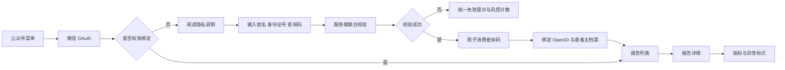
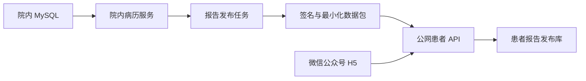
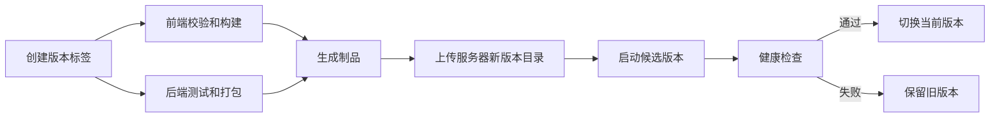

# 微信公众号患者化验报告查询服务 PRD

> 文档状态：方案评审稿，暂不进入开发
>
> 适用范围：微信公众号 H5 患者本人查询已发布化验报告
>
> 重要声明：本文件是产品与技术规划，不构成法律意见、医疗合规结论或上线批准。涉及真实患者信息前，必须由院方信息科、法务或数据合规负责人、业务负责人及网络安全负责人共同审核。

## 1. 文档目的

本 PRD 用于明确“患者通过已认证微信公众号查看系统内化验报告”的产品范围、业务规则、数据边界、安全要求、部署方式、合规审查事项和上线闸门。

当前阶段仅沉淀方案，不修改现有代码，不接入真实微信公众号，不上传真实患者数据，不开放公网患者查询。

## 2. 项目背景

当前院内系统已具备：

- 患者主档案与就诊记录。
- 姓名、证件类型、身份证号等身份字段。
- 化验室报告模板、指标结果、单位、参考范围和异常标识。
- 化验报告保存、完成交接和版本管理能力。
- 院内员工登录、角色权限及审计基础。

医生提出延伸需求：患者能够通过微信公众号移动端查询本人已完成的化验报告和各项化验指标。

该需求涉及身份证件信息、医疗健康信息、微信身份标识等敏感个人信息，因此不能简单开放姓名和身份证号查询接口，也不能将院内管理系统直接暴露到公网。

## 3. 产品目标

### 3.1 核心目标

- 让患者在微信公众号内安全查看本人已发布化验报告。
- 降低患者线下领取或重复咨询报告的成本。
- 保证患者只能访问本人数据。
- 保证草稿、内部备注、其他岗位病历和未发布报告不对患者开放。
- 建立查询码签发、微信绑定、报告发布、撤回和访问审计闭环。
- 在发生风险时可以快速停止患者端服务或撤回报告。

### 3.2 首版成功标准

- 患者能够通过微信 OAuth 进入 H5。
- 患者使用姓名、身份证号和院内一次性查询码完成首次本人绑定。
- 一个患者主档案只允许一个有效微信绑定。
- 一个微信首版只允许绑定一个患者主档案。
- 患者可以查看本人已发布报告列表及指标详情。
- 系统能够显示偏高、偏低和定性异常标识。
- 全部敏感操作有审计记录。
- 查询码撞库、身份枚举、越权查询和重复绑定受到控制。
- 院方能够作废查询码、解绑微信、撤回报告和关闭患者端入口。

## 4. 非目标

首版不包含：

- 家属代查。
- 未成年人监护人代理查询。
- 一个患者绑定多个微信。
- 一个微信管理多个家庭成员。
- 患者修改院内报告。
- 患者上传资料。
- 医生在线问诊。
- AI 自动诊断、疾病解释或治疗建议。
- 检查室原始图片对外发布。
- 全量病历、处方、手术记录或医生内部意见展示。
- 微信小程序。
- 跨医院数据共享。
- 公网服务直接访问院内 MySQL。

以上需求必须独立立项并重新进行授权、合规和安全评估。

## 5. 用户与角色

### 5.1 患者

- 通过微信公众号进入 H5。
- 首次完成本人身份绑定。
- 查看本人已发布化验报告。
- 查看报告指标及异常提示。
- 查看隐私说明和授权记录。
- 主动解绑微信。

### 5.2 院内查询码签发人员

建议角色：前台、化验室授权人员或管理员。

权限：

- 对已核验身份的患者签发查询码。
- 打印查询凭条或二维码。
- 查看查询码状态，不查看完整查询码明文。
- 作废未使用查询码。
- 重新签发新查询码。

### 5.3 报告发布人员

建议角色：化验室负责人、医生或配置的审核岗位。

权限：

- 将已完成报告标记为可向患者发布。
- 撤回已发布报告。
- 查看发布状态和同步结果。
- 处理失败重试。

### 5.4 安全与系统管理员

- 查询绑定关系和审计记录。
- 强制解绑。
- 冻结异常微信或患者绑定。
- 关闭患者查询入口。
- 查看安全告警和同步状态。
- 不得默认查看报告正文和完整身份证号。

## 6. 总体业务边界

### 6.1 患者端允许展示

- 脱敏患者姓名。
- 脱敏证件号末四位。
- 报告名称。
- 报告日期。
- 报告发布时间。
- 指标名称。
- 检测结果。
- 单位。
- 参考范围。
- 偏高、偏低或异常标识。
- 必要的患者提示语。

### 6.2 患者端禁止展示

- 完整身份证号。
- 联系电话和家庭地址。
- 医护账号、操作员姓名和角色。
- 内部审核意见。
- 草稿数据。
- 被作废或被替代的报告版本。
- 院内审计日志。
- 检查室原始图片。
- 其他岗位病历。
- 其他患者数据。
- 数据库主键、内部文件路径和存储地址。

## 7. 核心业务流程

### 7.1 院内身份核验与查询码签发

1. 院内工作人员按现行制度核验患者身份。
2. 系统确认患者主档案姓名和身份证号完整且无冲突。
3. 工作人员点击签发查询码。
4. 系统生成高熵随机查询码。
5. 数据库仅保存查询码哈希、患者 ID、签发人、有效期和状态。
6. 明文查询码仅在签发时显示一次，可打印为文字和二维码。
7. 患者遗失查询码时，工作人员作废旧码后重新签发。

### 7.2 微信首次绑定

1. 患者点击公众号菜单“我的报告”。
2. 进入微信 OAuth，服务端获得当前公众号下的 OpenID。
3. 系统判断 OpenID 是否已有有效绑定。
4. 未绑定时进入隐私说明和授权页。
5. 患者输入姓名、完整身份证号和一次性查询码。
6. 服务端执行联合校验。
7. 校验成功后，在同一数据库事务中消费查询码并创建绑定。
8. 返回患者报告列表。

### 7.3 日常查询

绑定完成后，患者再次进入时只通过微信 OAuth 识别身份，不重复传输姓名和身份证号。

### 7.4 解绑与换绑

- 患者可在 H5 主动解绑。
- 院内管理员可强制解绑。
- 解绑后所有患者会话立即失效。
- 换绑必须签发新的查询码。
- 新绑定成功后旧绑定保持失效。
- 首版不允许两个微信同时绑定同一患者。

## 8. 一次性查询码规则

### 8.1 生成规则

- 使用密码学安全随机数生成器。
- 推荐 12 至 16 位数字和大写字母组合。
- 排除容易混淆的字符。
- 不使用身份证后六位、手机号、生日、就诊号或病历号。
- 可同时生成二维码，二维码中只包含查询码或一次性绑定地址，不包含姓名和身份证号。

### 8.2 存储规则

- 数据库不得保存查询码明文。
- 保存带服务端密钥的 HMAC 摘要或适合高熵令牌的安全摘要。
- 保存签发时间、过期时间、使用时间、作废时间和状态。
- 明文仅在签发当次响应和打印流程中短暂存在。

### 8.3 状态

- `ISSUED`：已签发。
- `CONSUMED`：已使用。
- `EXPIRED`：已过期。
- `REVOKED`：已作废。
- `LOCKED`：异常失败后锁定。

### 8.4 有效期

建议初始设置为 48 小时，由院方确认是否调整为 24 或 72 小时。

### 8.5 失败控制

- 同一查询码连续失败达到阈值后锁定。
- 同一 OpenID、IP 和身份证摘要分别限流。
- 错误提示统一为“身份信息或查询码不匹配”。
- 不返回患者是否存在、查询码是否正确或身份证号哪一位错误。

## 9. 微信身份与患者绑定规则

### 9.1 微信身份

- 首版使用已认证服务号网页授权获得 OpenID。
- 仅申请完成业务所必需的授权范围。
- 不以微信昵称或头像作为患者身份凭证。
- OAuth 回调必须校验 `state`，防止 CSRF。
- OAuth 临时凭证不得写入普通日志。

### 9.2 绑定唯一性

- 患者主档案只能存在一个有效绑定。
- OpenID 只能存在一个有效患者绑定。
- 数据库使用唯一索引和事务保证并发安全。
- 查询码消费与绑定创建必须原子完成。

### 9.3 授权留痕

绑定时记录：

- 隐私政策版本。
- 授权文本版本。
- 授权时间。
- OpenID 的不可直接展示标识。
- 患者内部 ID。
- 客户端 IP 摘要或安全审计字段。
- 用户代理。
- 绑定结果。

## 10. 报告发布规则

患者端不得直接读取院内化验业务表。应建立独立的报告发布动作和患者报告发布库。

### 10.1 可发布条件

报告必须同时满足：

- 化验室任务已完成交接。
- 报告状态为有效。
- 报告未被新版本替代。
- 报告通过院方规定的审核。
- 报告明确标记为可向患者发布。
- 患者身份字段完整且无冲突。

### 10.2 发布内容

仅同步：

- 患者内部不可枚举 ID。
- 脱敏展示姓名。
- 证件号摘要及必要的加密字段。
- 报告外部 ID。
- 报告名称、日期、版本和发布时间。
- 指标名称、结果、单位、参考范围和异常标识。
- 发布与撤回状态。

### 10.3 不发布内容

- 全量患者档案。
- 原始身份证号明文。
- 检查图片和附件。
- 医护内部备注。
- 操作员身份。
- 其他病历阶段数据。
- 内部数据库 ID 和存储路径。

### 10.4 发布与撤回

- 发布操作需要有权限的院内人员确认。
- 发布成功后写入审计。
- 报告内容修改时生成新发布版本，不能静默覆盖。
- 撤回后患者端立即不可见。
- 患者已经打开的旧会话再次请求时也必须校验撤回状态。

## 11. 数据同步架构

### 11.1 推荐架构

### 11.2 关键原则

- 公网服务不得直接连接院内 MySQL。
- 院内系统主动向外推送。
- 数据包必须签名、防重放并包含时间戳和唯一消息 ID。
- 公网服务校验签名后才落库。
- 同一发布消息必须具备幂等性。
- 院内可以一键停止发布通道。
- 公网服务故障不能影响院内核心业务。

### 11.3 试点替代方案

在自动发布通道未建设前，可以使用虚拟患者或脱敏数据，通过授权人员上传加密发布包完成技术验证。

真实患者数据不建议通过邮件、即时通信软件或普通网盘传递。

## 12. 患者端页面需求

### 12.1 公众号入口页

- 触发微信 OAuth。
- 显示加载和失败重试。
- 非微信浏览器访问时提示在微信中打开。
- 不在 URL 中传递患者 ID、身份证号或查询码。

### 12.2 隐私说明与授权页

必须说明：

- 服务提供主体。
- 信息处理目的。
- 处理的数据类型。
- 数据使用范围。
- 保存期限。
- 是否存在受托处理方。
- 患者的查询、更正、解绑和撤回渠道。
- 联系与投诉方式。
- 安全风险说明。

患者未同意时不得继续绑定。

### 12.3 首次绑定页

字段：

- 姓名。
- 身份证号。
- 一次性查询码。
- 隐私授权勾选框。

交互要求：

- 身份证号输入后掩码显示。
- 不在前端持久化身份证号。
- 不写入浏览器本地存储。
- 页面刷新后清空敏感输入。
- 错误提示不暴露具体失败项。
- 连续失败后提示稍后重试或联系院方。

### 12.4 报告列表页

展示：

- 脱敏患者身份。
- 报告名称。
- 报告日期。
- 发布时间。
- 是否存在异常指标。
- 空状态和服务提示。

### 12.5 报告详情页

展示：

- 报告名称和日期。
- 指标名称。
- 结果。
- 单位。
- 参考范围。
- 异常标识。
- 报告版本。
- 发布说明。

固定提示：

> 检验结果仅供就医参考，异常标识不等同于临床诊断，请结合医生意见进行判断。

### 12.6 账户与解绑页

- 显示脱敏患者身份。
- 显示绑定时间。
- 查看当前隐私授权版本。
- 主动解绑。
- 联系院方。

解绑需要二次确认。

## 13. 患者端 API 边界

建议建立独立 `/patient-api/**` 安全域，不复用院内 `/clinic-api/**` 员工鉴权。

逻辑接口包括：

- 微信 OAuth 发起。
- 微信 OAuth 回调。
- 查询当前绑定状态。
- 首次绑定。
- 获取本人报告列表。
- 获取本人报告详情。
- 获取隐私政策。
- 解绑。
- 会话退出。

每个报告请求必须从当前患者会话推导患者 ID，不能信任前端传入的患者 ID。

## 14. 数据模型建议

### 14.1 患者微信绑定表

建议字段：

- 绑定 ID。
- 患者内部 ID。
- OpenID 加密值或受保护值。
- OpenID 摘要。
- 状态。
- 绑定时间。
- 解绑时间。
- 授权版本。
- 最近访问时间。
- 创建与更新时间。

唯一约束：

- 一个有效患者绑定。
- 一个有效 OpenID 绑定。

### 14.2 查询码表

建议字段：

- 查询码记录 ID。
- 患者内部 ID。
- 查询码摘要。
- 状态。
- 过期时间。
- 签发人及岗位。
- 签发时间。
- 使用时间。
- 作废时间和原因。
- 失败次数。
- 锁定时间。

### 14.3 患者报告发布表

建议字段：

- 发布记录 ID。
- 患者内部 ID。
- 原报告外部 ID。
- 报告版本。
- 报告名称。
- 报告日期。
- 指标 JSON 或规范化指标明细。
- 是否包含异常。
- 发布状态。
- 发布时间。
- 撤回时间和原因。
- 数据摘要。

### 14.4 患者端审计表

建议字段：

- 审计 ID。
- 事件类型。
- 患者内部 ID。
- 绑定 ID。
- OpenID 摘要。
- 报告发布 ID。
- 请求追踪 ID。
- 结果。
- 风险级别。
- IP 摘要。
- 用户代理摘要。
- 发生时间。

审计中不得记录完整身份证号、查询码和报告全文。

## 15. 安全需求

### 15.1 网络安全

- 全站 HTTPS。
- HTTP 强制跳转 HTTPS。
- 后端只监听本机或私网端口。
- 数据库不开放公网端口。
- 使用防火墙、安全组、WAF 或 API 网关。
- 限制管理端入口来源。
- 关闭不必要端口和服务。
- 定期更新操作系统、Java、Nginx 和数据库补丁。

### 15.2 会话安全

- 患者会话与院内员工会话完全隔离。
- Cookie 使用 `Secure` 和 `HttpOnly`。
- 根据架构配置合理的 `SameSite`。
- 会话短期有效，支持服务端撤销。
- 解绑、强制解绑和风险冻结后立即失效。
- 防止会话固定和重放。

### 15.3 应用安全

- 所有输入服务端校验。
- 防止 SQL 注入、XSS、CSRF、越权和路径遍历。
- 使用患者会话推导数据范围。
- 所有 ID 使用不可枚举标识。
- 接口按 OpenID、患者、IP 和设备维度限流。
- 敏感接口增加行为风控。
- 返回统一错误信息。

### 15.4 数据安全

- 身份证号应用层加密保存。
- 另存规范化身份证摘要用于精确匹配。
- OpenID 按敏感标识保护。
- 密钥与数据库分离。
- 生产密钥不进入 GitHub。
- 数据库磁盘和备份加密。
- 测试环境禁止使用真实患者数据。
- 日志自动脱敏。

## 16. GitHub 与发布要求

### 16.1 仓库要求

- 使用私有仓库。
- 开启分支保护和代码评审。
- 禁止提交生产密钥和患者数据。
- 禁止提交数据库备份、真实附件和生产日志。
- 配置依赖漏洞扫描和密钥泄露扫描。

### 16.2 构建制品

- 患者 H5 构建为 `dist`。
- 患者 API 构建为 Spring Boot `jar`。
- 制品通过 GitHub Actions Artifact、私有 Release 或制品库交付。
- 不建议将生成的 `dist` 和 `jar` 提交回源码分支。

### 16.3 发布流程

- 生产发布由版本标签或人工审批触发。
- 每次发布保留版本号和变更记录。
- 支持快速回滚。
- 数据库变更必须可回滚或兼容上一应用版本。

## 17. 部署架构

### 17.1 推荐生产架构

- 备案域名。
- 有效 HTTPS 证书。
- Nginx 或云负载均衡。
- 患者 H5 静态文件。
- Spring Boot 患者 API。
- 私网数据库。
- 日志与监控。
- 自动备份。
- WAF 或 API 网关。

### 17.2 个人服务器使用边界

个人服务器可以用于：

- 页面原型。
- 微信 OAuth 联调。
- 虚拟患者全流程测试。
- 自动部署验证。

承载真实患者数据前必须确认：

- 院方是否书面认可。
- 域名、备案和云账号主体是否合适。
- 数据控制者与运营责任主体。
- 运维人员和开发人员访问权限。
- 数据是否存储在境内。
- 安全评估、等级保护和医院制度要求。
- 安全事件责任和处置流程。

正式环境优先由医院或合法运营主体持有服务器、域名、云账号和数据库资源。

## 18. 监控与告警

必须监控：

- H5 可用性。
- API 错误率和延迟。
- 微信 OAuth 失败率。
- 绑定成功率和失败率。
- 查询码异常尝试。
- 同一 IP、OpenID 或身份证摘要的高频失败。
- 报告同步积压和失败。
- 数据库连接、容量和备份状态。
- 证书过期时间。
- 磁盘和内存。
- 非预期管理端访问。

严重告警应支持短信、电话或院方已有告警渠道，不能只发送到个人微信。

## 19. 审计要求

审计事件至少包括：

- 查询码签发。
- 查询码作废。
- 查询码重新签发。
- 首次绑定成功和失败。
- 报告列表查询。
- 报告详情查询。
- 患者解绑。
- 管理员强制解绑。
- 报告发布。
- 报告撤回。
- 数据同步失败和重试。
- 风险冻结和解除。
- 管理员查看敏感配置。

审计日志应防篡改、限制访问并制定保存期限。

## 20. 隐私与合规评审清单

真实数据上线前由院方确认：

- 服务提供主体和个人信息处理者是谁。
- 处理目的是否明确、合理且必要。
- 是否取得适当授权及敏感个人信息的单独同意。
- 患者拒绝授权是否影响非必要医疗服务。
- 隐私政策、授权文本和版本管理。
- 数据最小化范围。
- 数据保存期限和删除策略。
- 患者查询、更正、解绑、撤回和投诉渠道。
- 云服务商及其他受托处理方管理。
- 是否开展个人信息保护影响评估。
- 是否涉及网络安全等级保护。
- 是否符合医院信息系统接入和互联网医院相关制度。
- 数据是否存储在中国境内。
- 是否存在数据出境或境外访问。
- GitHub 是否仅保存源代码，不保存患者信息和生产秘密。
- 安全事件报告、患者通知和监管沟通流程。
- 服务停止时的数据迁移、删除和留存规则。

## 21. 风险登记

| 风险 | 影响 | 控制措施 |
| --- | --- | --- |
| 姓名和身份证号被他人掌握 | 冒名绑定 | 增加院内一次性查询码和微信绑定唯一性 |
| 查询码遗失 | 未授权绑定 | 短期有效、单次使用、可作废和重签 |
| 暴力枚举 | 患者存在性和报告泄露 | 多维限流、统一错误、风控锁定 |
| 微信账号更换 | 患者无法访问或旧账号继续访问 | 新查询码换绑、旧会话立即失效 |
| 公网服务被攻击 | 批量数据泄露 | 最小数据副本、WAF、隔离数据库、加密和监控 |
| 公网服务直连院内库 | 院内核心系统暴露 | 禁止反向直连，院内主动推送 |
| 报告误发布 | 患者看到错误或未审核数据 | 显式发布、审核状态、版本和撤回机制 |
| 个人服务器责任不清 | 合规和事故责任风险 | 正式上线前迁移至院方或合法主体资源 |
| GitHub 泄密 | 密钥或数据外泄 | 私有仓库、Secret 管理、扫描和提交拦截 |
| 日志记录敏感数据 | 二次泄露 | 日志脱敏、禁止记录请求正文和明文身份信息 |
| 备份泄露 | 批量历史数据泄露 | 备份加密、访问控制和定期恢复验证 |

## 22. 测试与验收

### 22.1 功能测试

- 查询码签发、打印、作废和重签。
- 首次绑定。
- 重复绑定阻止。
- 查询码过期、已使用和锁定。
- 报告发布、列表、详情和撤回。
- 患者解绑与换绑。
- 微信 OAuth 异常恢复。

### 22.2 权限测试

- 患者 A 不得访问患者 B 数据。
- 修改 URL 或报告 ID 不得越权。
- 未绑定微信不得访问报告。
- 已解绑会话不得继续使用。
- 被撤回报告不得继续访问。
- 员工权限和患者权限不得混用。

### 22.3 安全测试

- SQL 注入。
- XSS。
- CSRF。
- 会话固定和重放。
- 查询码暴力破解。
- 身份证枚举。
- 接口限流。
- 敏感日志扫描。
- 配置和密钥泄露扫描。
- 依赖漏洞扫描。
- 渗透测试。

### 22.4 数据测试

- 报告版本一致性。
- 异常指标标识一致性。
- 发布和撤回幂等性。
- 同步重试不产生重复数据。
- 并发绑定只能成功一次。
- 备份和恢复后绑定、发布与审计数据完整。

## 23. 灰度发布方案

1. 仅使用虚拟患者完成开发和联调。
2. 使用脱敏数据完成安全测试。
3. 由院方确认合规、部署主体和授权文本。
4. 选择少量内部志愿者或受控测试患者。
5. 限定报告类型和开放时间。
6. 每日复核绑定、查询和异常日志。
7. 验证撤回、解绑和紧急关闭能力。
8. 通过验收后逐步扩大范围。

## 24. 应急处置

必须具备：

- 一键关闭患者 H5。
- 一键拒绝患者 API。
- 暂停院内报告发布。
- 批量撤销患者会话。
- 冻结异常绑定。
- 撤回指定报告。
- 保留证据和安全审计。
- 通知院方信息科、法务和负责人。
- 按院方及监管要求评估是否通知患者。

应急关闭不能影响院内核心病历业务。

## 25. 待院方决策事项

- 是否同意微信公众号提供患者本人报告查询。
- 服务主体和责任主体。
- 是否允许使用现有个人服务器进行真实数据试点。
- 正式环境是否迁移到医院或合法运营主体资源。
- 隐私政策和单独同意文本。
- 查询码有效期。
- 查询码签发岗位。
- 报告审核和发布岗位。
- 哪些报告模板允许发布。
- 报告完成后自动发布还是人工发布。
- 患者数据保存期限。
- 审计日志保存期限。
- 等级保护、安全测评和渗透测试要求。
- 是否允许使用 GitHub 私有仓库及其适用边界。
- 云服务商、数据库和备份选型。
- 安全事件联系人和应急流程。

## 26. 上线闸门

以下事项全部通过前，不得接入真实患者数据：

- 院方业务负责人批准。
- 信息科架构和安全评审通过。
- 法务或数据合规评审通过。
- 服务主体与责任主体明确。
- 隐私告知和授权文本定稿。
- 部署环境和云资源归属确认。
- 数据最小化和发布边界确认。
- 微信公众号域名与 OAuth 配置完成。
- HTTPS、WAF、数据库隔离和备份完成。
- 权限、越权、限流和渗透测试通过。
- 审计、告警、撤回和应急关闭验证通过。
- 灰度方案和应急联系人明确。

## 27. 后续阶段候选需求

首版稳定并重新完成评估后，可考虑：

- 家属代查和监护人授权。
- 一个患者绑定多个微信。
- PDF 报告下载。
- 报告发布消息提醒。
- 医生解释预约入口。
- 其他检验和检查类型。
- 医院统一患者身份平台对接。
- 短信实名验证。
- 微信小程序。

每项均需重新评估数据必要性、授权、权限和风险。

## 28. 当前结论

该需求在技术上可落地，但不应将其理解为简单部署一个 H5。完整产品必须包含：

- 微信 OAuth 身份入口。
- 院内一次性查询码。
- 患者本人绑定。
- 独立患者 API 安全域。
- 最小化报告发布库。
- 院内主动发布机制。
- 报告发布和撤回。
- 加密、限流、审计、告警与应急关闭。
- 院方合规和安全批准。

当前建议保持“方案冻结、暂不开发”状态。个人服务器只用于虚拟数据和技术验证；真实患者数据是否可以承载，必须等待院方对服务主体、部署归属、信息安全及敏感个人信息处理方案作出正式确认。
